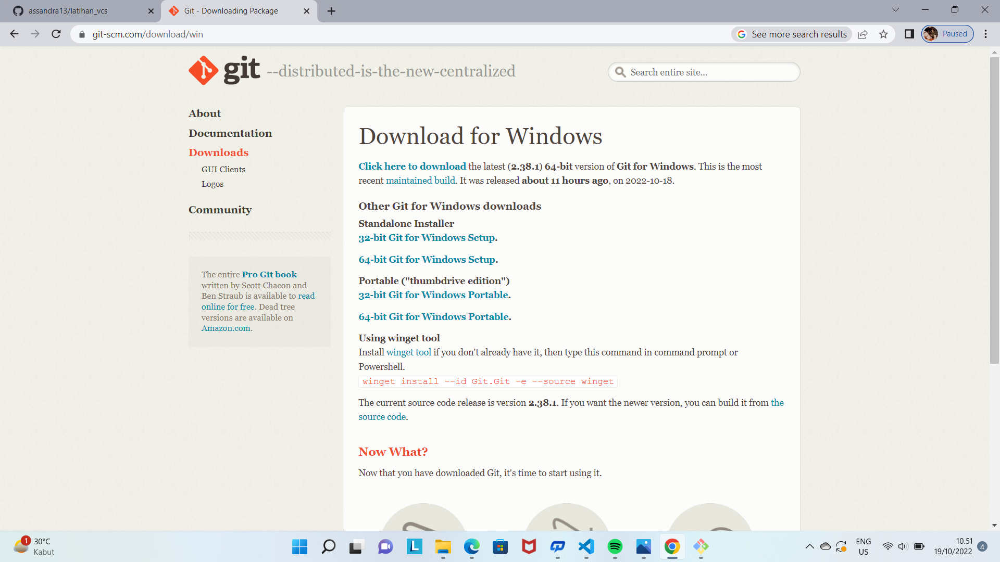
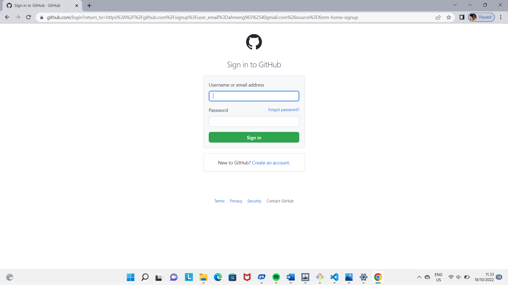
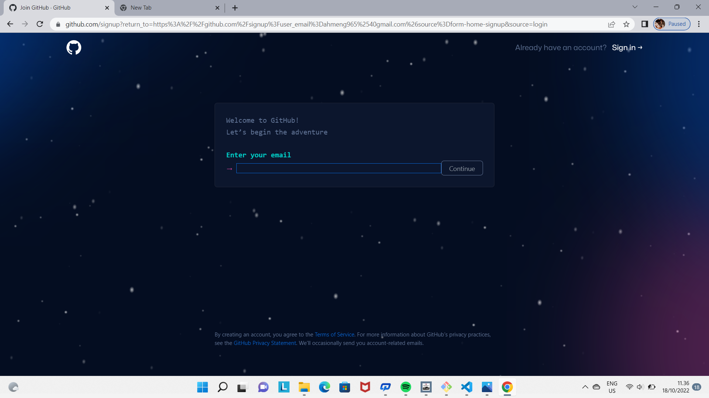
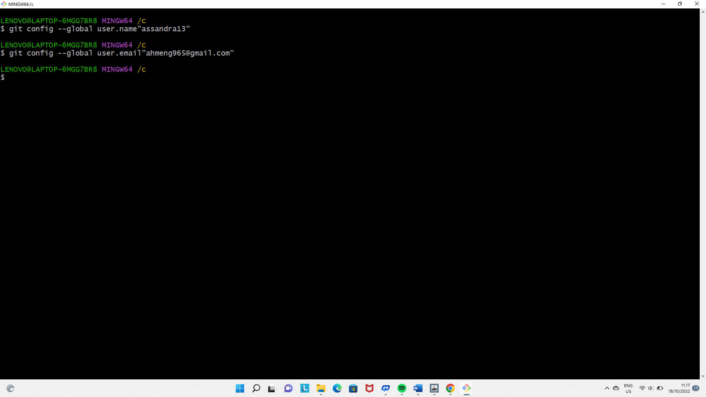
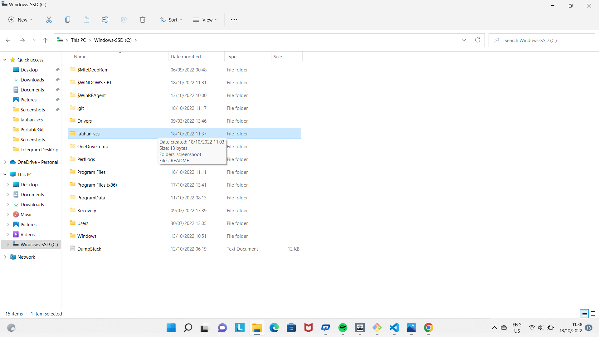
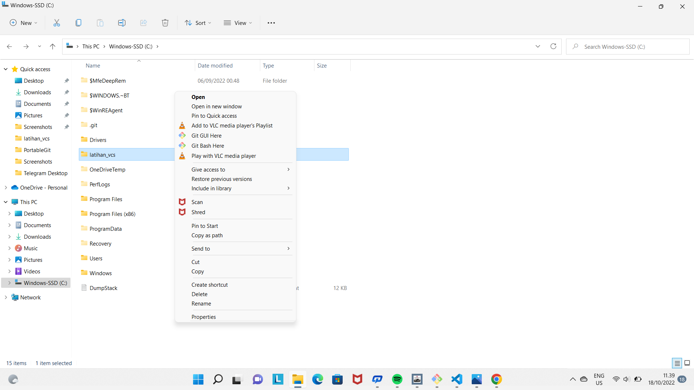
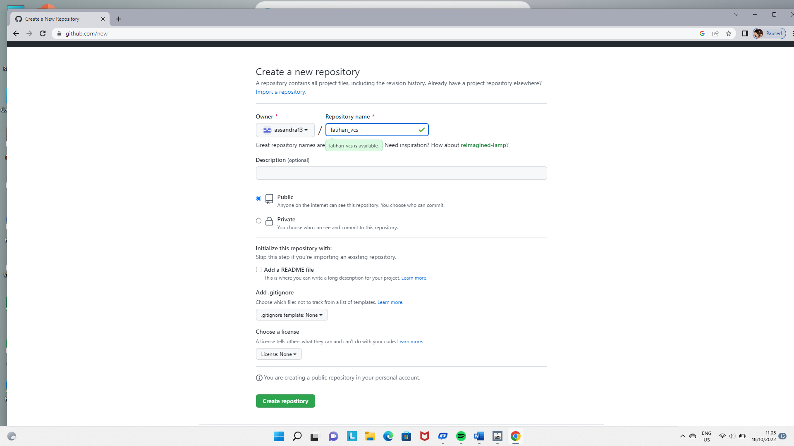

#latihan_vcs
tatacara penggunaan git

1. download git di situs resmi git di website 

2. membuat akun github di website github.com 

3. tambah global username dan email

4. cara membuat repository local di laptop dengan nama yang di inginkan dan cara menjadikannya sebuah file repository dengan menggunakan command "git init"

.png)

5. cara membuat repository di git hub

6. cara menambahkan file README.md ke repository kita
.png)

7. kirim file ke repository git hub dengan git push -u origin master
.png)
