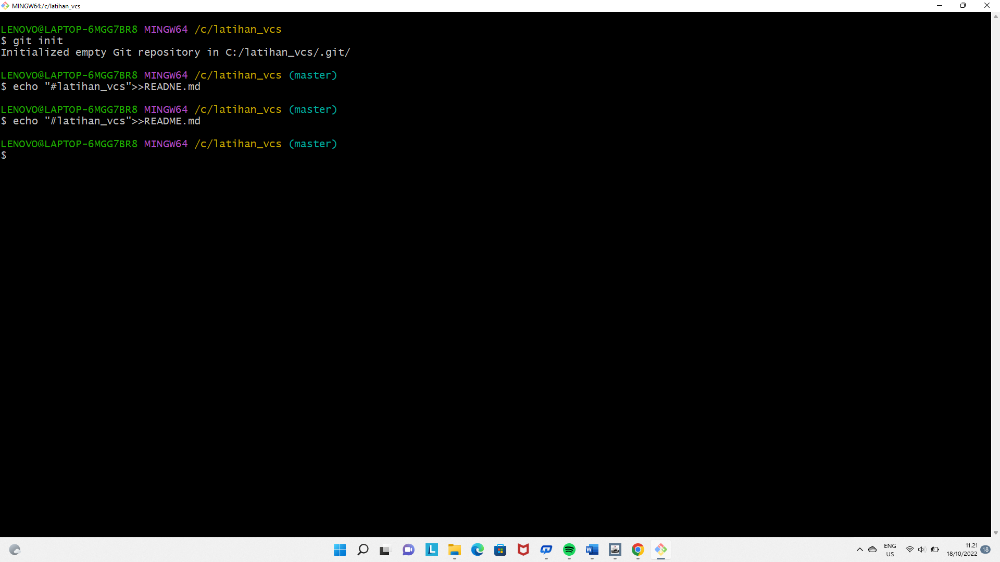

#latihan_vcs

1.download git di situs resmi git

2.setelah mendownload akun git bikin akun git dengan email Anda

3.setelah mendownload git 
lakukan konfigurasi menggunkan username dan email anda

setelah itu lakukan perintah dasar git untuk membuat file repository

